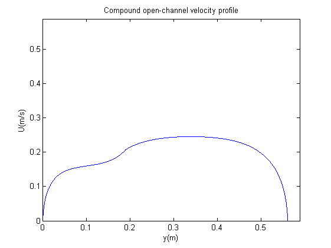

---
layout: post
title:  "Velocity Profile"
date:   2018-10-27 15:00:00 +0100
--- 
  
<html>
   <head>
      <meta http-equiv="Content-Type" content="text/html; charset=utf-8">
   
      <!--
This HTML is auto-generated from an M-file.
To make changes, update the M-file and republish this document.
      -->
      <title>VelocityProfile</title>
      <meta name="generator" content="MATLAB 7.7">
      <meta name="date" content="2010-11-29">
      <meta name="m-file" content="VelocityProfile"></head>
   <body>
      

         <h2>Contents</h2>
         

            <ul>
               <li><a href="#1">Program VePro</a></li>
               <li><a href="#2">Assembling the matrices  A,B,C,D</a></li>
               <li><a href="#3">Assembling the Final matrix</a></li>
               <li><a href="#4">Gauss-Jordan Elimination</a></li>
               <li><a href="#5">Defferential equation</a></li>
               <li><a href="#6">Plot</a></li>
            </ul>
         

         <h2>Program VePro</h2><pre>    The  program VePro, using a  linearized fully parabolic version
  of the  depth-averaged  flow  equations, calculates an analytical
  solution for the transverse distribution of longitudinal velosity
  in  rectangular channels  and  as well as in channels of compound
  cross-section.
    The program  also calculates the  discharge with the Analytical
  method and with the Mannings formula.
  Here  we give an  example  for a channel with two  cross-sections.</pre><pre class="codeinput">    %_____________________________# INPUT #________________________________
    % Insert the sum of the cross sections
    cs=2;

    % Insert the hights hi=[h1,h2,h3....hv]
    hi=[0.025,0.05];

    % Insert the width of each cross section Dy=[Dy1,Dy2,Dy3....Dyv]
    Dy=[0.19,0.37];

    % Insert the manning number ni=[n1,n2,n3....nv]
    ni=[0.0116,0.0116];

    % Insert the discretization accuracy
    Sum=1000;

    % Insert the slope
    s=0.00047;

    % Insert the Gravity (m/s^2)
    g=9.81;

    % Insert the cv=[cv1,cv2,cv3....cvv]
    Cv=[0.20,0.20];
    %______________________________________________________________________

%__________________________________## BEGIN ##_____________________________
%Setting the matrices where we will save the parameters
    h=[hi,0];
    n=[ni,0];
    a=zeros(1,cs);
    b=zeros(1,cs);
    Cf=zeros(1,cs);
    gt=zeros(1,cs);
    H=zeros(1,cs+1);
    Ai=zeros(1,cs);
    Bi=zeros(1,cs);
    Ci=zeros(1,cs);
    Di=zeros(1,cs);
    Gt1=zeros(1,cs);
    Gt2=zeros(1,cs);
    Ca=zeros(1,cs);
    Cb=zeros(1,cs);

% Calculate the &#945;, b, &#947; parameters for each cross-section

    for k=1:cs

        Cf(k)=n(k)^2*g/(h(k)^(1/3));
        a(k)=sqrt(2*sqrt(Cf(k))/(Cv(k)*h(k)^2));
        b(k)=-a(k)^2*g*(h(k))*s/Cf(k);
        gt(k)=-b(k)/a(k)^2;

        H(k+1)=(n(k+1)/n(k))*(h(k+1)/h(k))^(5/6);
    end

% Print on screen the matrices [Cf],[a],[b],[&#947;]
   sp=[Cf',a',b',gt'];
   format short e;
   disp('     [Cf]          [a]          [b]          [&#947;]');
   disp(sp);
</pre><pre class="codeoutput">     [Cf]          [a]          [b]          [&#947;]
  4.5145e-003  3.2788e+001 -2.7449e+001  2.5533e-002
  3.5831e-003  1.5474e+001 -1.5405e+001  6.4339e-002

</pre><h2>Assembling the matrices  A,B,C,D</h2><pre class="codeinput">for i=1:cs
    for j=1:cs

          Ai(i,i)=-1;
          Bi(i,i)=-1;

          Ci(i,i)=exp(a(i)*Dy(i));
          Di(i,i)=-exp(-a(i)*Dy(i));

        if i==j+1
           Ai(i,j)=exp(a(j)*Dy(j));
           Bi(i,j)=exp(-a(j)*Dy(j));
        end;

        if i==j-1
           Ci(i,j)=-H(i+1)*a(i+1)/a(i);
           Di(i,j)=H(i+1)*a(i+1)/a(i);
        end;

    end
end

% Corrections added to the matrices
       Ai(1,1)=1;
       Bi(1,1)=1;
       Di(cs,cs)=-Di(cs,cs);
</pre><h2>Assembling the Final matrix</h2><pre class="codeinput">% Assembling the [&#947;] matrix
 for i=2:cs
       Gt1(i)=gt(i)-gt(i-1);
 end
      Gt1(1)=-gt(1);
      Gt2(cs)=-gt(cs);

     FM=[Ai,Bi,Gt1';Ci,Di,Gt2'];
        disp('                 ');
        disp('                 ');
        disp('  Final Matrix assembled');
        disp('                 ');
        disp(FM);
</pre><pre class="codeoutput">                 
                 
  Final Matrix assembled
                 
  1.0000e+000            0  1.0000e+000            0 -2.5533e-002
  5.0759e+002 -1.0000e+000  1.9701e-003 -1.0000e+000  3.8806e-002
  5.0759e+002 -8.4090e-001 -1.9701e-003  8.4090e-001            0
            0  3.0652e+002            0  3.2624e-003 -6.4339e-002

</pre><h2>Gauss-Jordan Elimination</h2><pre class="codeinput">  GJ=rref(FM);

     rGJ=cs*2;
      cGJ=cs*2+1;
       GJn=GJ(1:rGJ,cGJ);
         format short e;

         Ca=GJn(1:cs);
         Cb=GJn(cs+1:rGJ);
           CC=[Ca,Cb];
              disp('                      ')
              disp('       Ca           Cb');
              disp(CC);
</pre><pre class="codeoutput">                      
       Ca           Cb
  3.4536e-005 -2.5568e-002
 -2.0968e-004 -2.1117e-002

</pre><h2>Defferential equation</h2><pre class="codeinput">Ui=zeros(cs,Sum);
Qan=0;
q=0;
ss=1;
for z=1:cs

        W=zeros(1,Sum);
            yi=linspace(0,Dy(z),Sum);
               if z==1
                  y(ss:z*Sum)=yi;
               else
                  y(ss:z*Sum)=yi+y((z-1)*Sum);
               end;

    W=Ca(z)*exp(a(z)*yi)+ Cb(z)*exp(-a(z)*yi)+gt(z);
        Ui(z,1:Sum)=sqrt(W);
             U(ss:z*Sum)=Ui(z,1:Sum);
                 ss=ss+Sum;

% Calculate the Discharge Analyticaly
       dy=Dy(z)/Sum;
       for l=1:Sum
          q=Ui(z,l)*h(z)*dy;
          Qan=Qan+q;
          q=0;
       end
       dy=0;

end

% $Example
% Discharge for compound channel with two rectangular cross-sections
% Manning equation
   A1=h(1)*Dy(1);
   A2=h(2)*Dy(2);
   P1=h(1)+Dy(1);
   P2=h(2)+Dy(2)+(h(2)-h(1));
   R1=A1/P1;
   R2=A2/P2;

   q1=1/n(1)*A1*R1^(2/3)*s^0.5;
   q2=1/n(2)*A2*R2^(2/3)*s^0.5;
   Qm=q2+q1;

   Q=[Qan,Qm];

% Print on screen the results
   disp('      Discharge (m^3/s)');
   disp(' ');
   disp('       Qan        Qman  ');
   disp(Q);
% $End of Exmaple
</pre><pre class="codeoutput">      Discharge (m^3/s)
 
       Qan        Qman  
  4.7705e-003  4.8482e-003

</pre><h2>Plot</h2><pre class="codeinput">B=sum(Dy);

plot(y,U);
%Setting the graph borders
axis ([0 B+B/20 0 B+B/20]) ;
xlabel('y(m)');
ylabel('U(m/s)');
title('Compound open-channel velocity profile');

%________________________________## END ##_________________________________
</pre>
 
 
            Published with MATLAB&reg; 7.7 

      

      <!--
##### SOURCE BEGIN #####
%% Program VePro
%      The  program VePro, using a  linearized fully parabolic version    
%    of the  depth-averaged  flow  equations, calculates an analytical     
%    solution for the transverse distribution of longitudinal velosity    
%    in  rectangular channels  and  as well as in channels of compound    
%    cross-section.                                                       
%      The program  also calculates the  discharge with the Analytical    
%    method and with the Mannings formula.                                                                           
%    Here  we give an  example  for a channel with two  cross-sections.   

    %_____________________________# INPUT #________________________________  
    % Insert the sum of the cross sections 
    cs=2;
    
    % Insert the hights hi=[h1,h2,h3....hv]
    hi=[0.025,0.05];
    
    % Insert the width of each cross section Dy=[Dy1,Dy2,Dy3....Dyv]
    Dy=[0.19,0.37];
    
    % Insert the manning number ni=[n1,n2,n3....nv]
    ni=[0.0116,0.0116];
    
    % Insert the discretization accuracy
    Sum=1000;
    
    % Insert the slope
    s=0.00047;
     
    % Insert the Gravity (m/s^2)
    g=9.81;
    
    % Insert the cv=[cv1,cv2,cv3....cvv]
    Cv=[0.20,0.20];
    %______________________________________________________________________

%__________________________________## BEGIN ##_____________________________    
%Setting the matrices where we will save the parameters
    h=[hi,0];
    n=[ni,0];
    a=zeros(1,cs);
    b=zeros(1,cs);
    Cf=zeros(1,cs);
    gt=zeros(1,cs);
    H=zeros(1,cs+1);
    Ai=zeros(1,cs);
    Bi=zeros(1,cs);
    Ci=zeros(1,cs);
    Di=zeros(1,cs);
    Gt1=zeros(1,cs);
    Gt2=zeros(1,cs);
    Ca=zeros(1,cs);
    Cb=zeros(1,cs);
     
% Calculate the α, b, γ parameters for each cross-section  
    
    for k=1:cs
        
        Cf(k)=n(k)^2*g/(h(k)^(1/3));    
        a(k)=sqrt(2*sqrt(Cf(k))/(Cv(k)*h(k)^2));    
        b(k)=-a(k)^2*g*(h(k))*s/Cf(k);
        gt(k)=-b(k)/a(k)^2;

        H(k+1)=(n(k+1)/n(k))*(h(k+1)/h(k))^(5/6);
    end
   
% Print on screen the matrices [Cf],[a],[b],[γ]
   sp=[Cf',a',b',gt'];
   format short e;
   disp('     [Cf]          [a]          [b]          [γ]');        
   disp(sp);
      
%% Assembling the matrices  A,B,C,D
  
for i=1:cs
    for j=1:cs 
       
          Ai(i,i)=-1;
          Bi(i,i)=-1; 
          
          Ci(i,i)=exp(a(i)*Dy(i)); 
          Di(i,i)=-exp(-a(i)*Dy(i));
          
        if i==j+1
           Ai(i,j)=exp(a(j)*Dy(j));
           Bi(i,j)=exp(-a(j)*Dy(j));
        end;
      
        if i==j-1 
           Ci(i,j)=-H(i+1)*a(i+1)/a(i);
           Di(i,j)=H(i+1)*a(i+1)/a(i);
        end;   

        
    end
end

% Corrections added to the matrices
       Ai(1,1)=1;
       Bi(1,1)=1;
       Di(cs,cs)=-Di(cs,cs);
       
%% Assembling the Final matrix

% Assembling the [γ] matrix
 for i=2:cs
       Gt1(i)=gt(i)-gt(i-1); 
 end         
      Gt1(1)=-gt(1);         
      Gt2(cs)=-gt(cs);

     FM=[Ai,Bi,Gt1';Ci,Di,Gt2'];
        disp('                 ');
        disp('                 ');
        disp('  Final Matrix assembled');
        disp('                 ');
        disp(FM);
                  
%% Gauss-Jordan Elimination
  GJ=rref(FM);
                
     rGJ=cs*2;
      cGJ=cs*2+1;
       GJn=GJ(1:rGJ,cGJ);
         format short e;
        
         Ca=GJn(1:cs);
         Cb=GJn(cs+1:rGJ);
           CC=[Ca,Cb];
              disp('                      ') 
              disp('       Ca           Cb');
              disp(CC);
              
%% Defferential equation
Ui=zeros(cs,Sum);
Qan=0;
q=0;
ss=1; 
for z=1:cs
   
        W=zeros(1,Sum);
            yi=linspace(0,Dy(z),Sum);
               if z==1         
                  y(ss:z*Sum)=yi;
               else
                  y(ss:z*Sum)=yi+y((z-1)*Sum);
               end;

    W=Ca(z)*exp(a(z)*yi)+ Cb(z)*exp(-a(z)*yi)+gt(z); 
        Ui(z,1:Sum)=sqrt(W);
             U(ss:z*Sum)=Ui(z,1:Sum);
                 ss=ss+Sum;
                    
% Calculate the Discharge Analyticaly
       dy=Dy(z)/Sum;
       for l=1:Sum
          q=Ui(z,l)*h(z)*dy;
          Qan=Qan+q;
          q=0;
       end  
       dy=0; 

end

% $Example
% Discharge for compound channel with two rectangular cross-sections
% Manning equation
   A1=h(1)*Dy(1);
   A2=h(2)*Dy(2);
   P1=h(1)+Dy(1);  
   P2=h(2)+Dy(2)+(h(2)-h(1));     
   R1=A1/P1;
   R2=A2/P2;

   q1=1/n(1)*A1*R1^(2/3)*s^0.5;
   q2=1/n(2)*A2*R2^(2/3)*s^0.5;
   Qm=q2+q1;

   Q=[Qan,Qm];

% Print on screen the results 
   disp('      Discharge (m^3/s)');
   disp(' ');
   disp('       Qan        Qman  ');
   disp(Q);
% $End of Exmaple

%% Plot 
B=sum(Dy);
 
plot(y,U);
%Setting the graph borders
axis ([0 B+B/20 0 B+B/20]) ;
xlabel('y(m)');
ylabel('U(m/s)');
title('Compound open-channel velocity profile');

%________________________________## END ##_________________________________

##### SOURCE END #####
-->
   </body>
</html>

